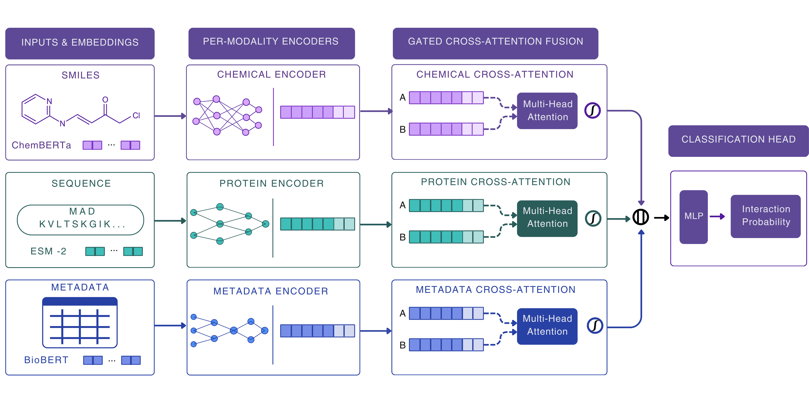

# MoDAN: Modality-Disentangled Attention Network for DDI Prediction

[](https://opensource.org/licenses/MIT)
[](https://www.python.org/)
[](https://pytorch.org/)

<p align="center">
  
</p>

## Overview

**MoDAN** is a topology-free multimodal deep learning framework for drug–drug interaction (DDI) prediction. Unlike graph-based methods, MoDAN operates on intrinsic drug properties alone and generalizes to previously unseen compounds.

Integrates **ChemBERTa** (molecules) + **ESM-2** (proteins) + **BioBERT** (pathways) via gated cross-attention that dynamically filters noisy modalities.

## 🎯 Key Results

| Dataset | S1 (Old-New) | S2 (New-New) | BIOSNAP | ZhangDDI |
|---------|--------------|--------------|---------|----------|
| **ROC-AUC** | 0.8548 ± 0.0004 | **0.7378 ± 0.0015** | 0.7296 ± 0.0094 | 0.7232 ± 0.0040 |

Strictly inductive evaluation on completely held-out compounds.

---

## ⚡ Quick Start

```bash
# 1. Clone & install
git clone https://github.com/srajalcodes/MoDAN.git
cd MoDAN
conda env create -f environment.yml
conda activate modan
pip install -r requirements.txt

# 2. Download weights & data
python src/utils/setup_data.py

# 3. Evaluate
python src/evaluation/compute_evaluation_metrics.py
```

That's it. `setup_data.py` automatically downloads from Zenodo and organizes everything.

---

## 📖 Usage

**Reproduce all results:**
```bash
python src/evaluation/evaluate_zero_shot_transfer.py
python src/analysis/analyze_model_interpretability.py
```

**Train from scratch:**
```bash
python src/training/train_modan.py
```

**Run baselines & ablations:**
```bash
python src/training/train_xgboost_multimodal.py
python src/training/run_ablation_study.py
```

Full documentation in `docs/reproducibility.md`.

---

## 📁 Repository Structure

```
MoDAN/
├── src/
│   ├── model/              # MoDAN architecture
│   ├── training/           # Train scripts
│   ├── evaluation/         # Evaluation & metrics
│   ├── analysis/           # Interpretability
│   ├── preprocessing/      # Data pipeline
│   ├── embeddings/         # ESM-2, ChemBERTa, BioBERT
│   ├── utils/              # setup_data.py
│   └── visualization/      # Plots & heatmaps
├── data/
│   ├── embeddings/         # Pre-computed embeddings
│   ├── processed/          # Benchmark splits
│   └── metadata/           # Drug annotations
├── configs/                # Hyperparameters
├── results/
│   ├── figures/            # Publication figures
│   ├── tables/             # Results tables
│   └── logs/               # Training logs
└── environment.yml / requirements.txt
```

---

## 📊 Data & Model Availability

**Complete reproducibility package** (model weights, embeddings, datasets):

🔗 **Zenodo DOI:** https://doi.org/10.5281/zenodo.21221081

The Zenodo archive contains:
- Pre-trained MoDAN checkpoint (modan_final_model.pt)
- ChemBERTa, ESM-2, BioBERT embeddings
- DrugBank, BIOSNAP, ZhangDDI evaluation splits

**Note:** Raw DrugBank XML is not redistributed. Researchers must obtain an academic license directly from DrugBank before running dataset reconstruction.

---

## 💬 Citation

If you use MoDAN, please cite:

```bibtex
@dataset{sharma2026modan,
  author    = {Sharma, Dolly and Tiwari, Srajal and Singh, Juhi and Singh, Tanishq},
  title     = {Dataset and Pre-Trained Weights for MoDAN},
  year      = {2026},
  publisher = {Zenodo},
  doi       = {10.5281/zenodo.21221081},
  url       = {https://doi.org/10.5281/zenodo.21221081}
}
```

And the accompanying manuscript (upon publication).

---

## 📄 License

MIT License. See `LICENSE` for details.

DrugBank-derived datasets remain subject to original DrugBank licensing terms.
